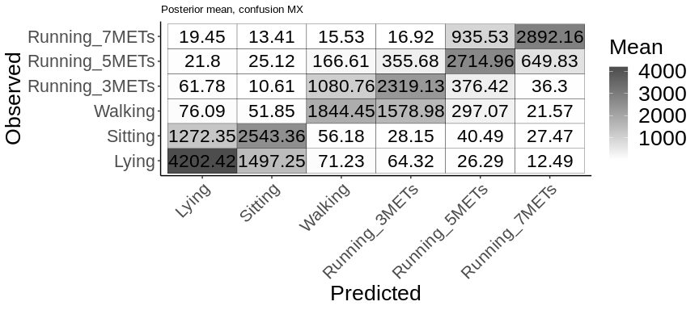
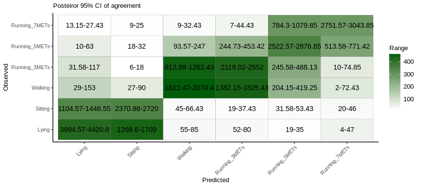
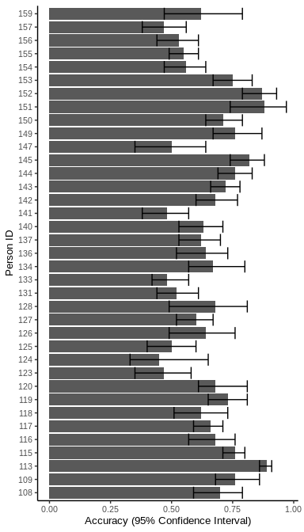
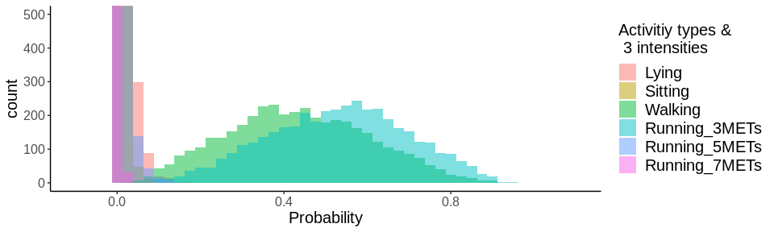
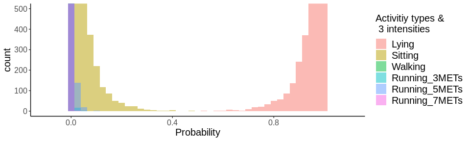

#### Load and prepare posterior simulation of BART test data 
Each file represents test data for each participant by leave-one-out CV.   
The files are generated by the script, BART_BatchCode.R
Unit of analysis is 5 second time points 

```r
rm(list = ls())

library(stringr)
library(tidyverse)
library(parallel)
library(data.table)
library(caret)
library(scales)
library(parallel)
library(htmlTable)
library(kableExtra)

# Plot format
theme_set(theme_classic())
theme_update(
  text = element_text(size = 10), 
  plot.title = element_text(size = 10), 
  legend.text = element_text(size = 10), 
  legend.title = element_text(size = 10)
)

# Function to process each file
funcLoad <- function(filePath, element){
  cat(c("loading -----", filePath))
  d <- readRDS(filePath)
  return(d[element])
}

source("functions/funcBARTPosterior.R")
```


```r
# Name files ---------
# list of filenames generated by BART_run script - there are 37 files, each representing leave-one-out-CV prediction from 37 people.  
listPostFile_parallel <- list.files("data_output/Parallel", pattern="BART_PostSimTestTrain", full.names=TRUE)

# Extract file IDs 
nameIndex<- str_replace(listPostFile_parallel, '.+loocv_(.+)', '\\1') %>% 
  str_replace('(.+).rds', '\\1') 

# is there duplicated person ID?
nameIndex[str_remove(nameIndex, "_ArrayIndex_\\d+") %>%  duplicated ]


# Load data ------------
# load data element 2 (Prediction from test data, first element is prediction from training data) 
bool_loadPostFiles = FALSE # 
if(bool_loadPostFiles){ # If true, load individual files and combine - takes time   
  b <- lapply(listPostFile_parallel, funcLoad, 2) 
  names(b) <- listPostFile_parallel
  saveRDS(b, "data_output/Parallel/b.rds")
}else{# load already combined file 
  b <- readRDS("data_output/Parallel/b.rds") # loading pre-saved file 
}


# Information about participant demographics -- these data are stripped from the public version  
demogTable <- readRDS("data/demogTable.rds")

# Names ---------------------------------------------
# check files and shorten list name - one person was accidentally duplicated 
bNamesIndex <- names(b) %>% str_replace('.+loocv_(.+)', '\\1') %>% 
  str_replace('(.+).rds', '\\1') 

str_remove(bNamesIndex, "_ArrayIndex_\\d+") %>%  
  duplicated %>%  
  sum

# Are there duplicated person ID (tested twice by accident)
bNamesIndex[
  str_remove(bNamesIndex, "_ArrayIndex_\\d+") %>%  duplicated]
names(b) <- bNamesIndex


# Combine everyone as data.table 
bDt <- bind_rows(b, .id = "personID")
```


#### Participant information 
Demographic and biological information will be removed in the paper unless aggregated, for anonymity.  
`UnitAnalysis` indicates the number of time points, 5 sec window.
`rowTime` indicates the numner of row time points (30 HZ, not aggregated at 5 second window)

```r
data.frame(
  PersonID = as.integer(str_remove(names(b), "_ArrayIndex_\\d+")), 
  UnitAnalysis = lapply(b, function(x) length(unique(x$windowID))) %>% unlist 
) %>% 
  left_join(demogTable, by = c("PersonID"="participant_id")) %>% 
  rename(rowTime = countTime)  %>% 
  select(-gender, -age, -height, -weight)
```

```
##    PersonID UnitAnalysis rowTime
## 1       126          688  471085
## 2       118          695  492289
## 3       124          666  465058
## 4       125          694  447735
## 5       127          683  464372
## 6       113          664  492766
## 7       108          685  443306
## 8       115          700  448649
## 9       123          693  485717
## 10      117          716  543424
## 11      120          692  464446
## 12      116          706  468452
## 13      159          685  455485
## 14      157          688  465003
## 15      128          701  455703
## 16      134          685  491597
## 17      109          676  456473
## 18      152          682  452573
## 19      155          685  485824
## 20      151          687  449403
## 21      149          690  464198
## 22      145          723  487244
## 23      131          685  442073
## 24      153          685  478819
## 25      137          679  464418
## 26      147          681  452846
## 27      144          668  455039
## 28      119          685  478711
## 29      133          676  575291
## 30      141          670  445720
## 31      136          689  470908
## 32      140          684  459211
## 33      150          690  493603
## 34      142          682  451324
## 35      156          692  515152
## 36      143          689  449823
## 37      154          685  476649
```


#### Two confusion MXs:    
  Top MX  Posterior mean of agreement for each cross-classification - not different form the standard confusion MX      
  Bottom MX   Posterior 95% Credible interval for agreement 


```r
#Split by MCMC sample and compute CMX in each sample  
bDtSplit <- split(bDt, list(bDt$mcmcItr))
funcCMX <- function(x){return(confusionMatrix(factor(x$maxProbClass), factor(x$obsClass)))}

c <- mclapply(bDtSplit, funcCMX)
c <- mclapply(c, function(x) x$table %>% data.frame) 

# Combine all cMX 
c <- c %>% reduce(left_join, by = c("Prediction","Reference"))
colnames(c) <- c("Prediction","Reference", 1:{ncol(c)-2})


# Create summary stats data frame across all prediction/observation pairs 
cSummary <- bind_cols(c[,1:2], Mean = rowMeans(c[, 3:ncol(c)])) %>% 
  bind_cols(
    apply(c[, 3:ncol(c)], 1, quantile, probs=c(0.025, 0.975)) %>%  
    t() %>% 
    data.frame() %>% 
    rename(L = X2.5., U =X97.5.) %>% 
    mutate(Range = U-L, CI = paste(round(L, 2), "-",round(U,2), sep =""))
    )

# Create data frame to label class 
levels(bDt$obsClassLabel) <- c("Lying", "Sitting", "Walking", "Running_3METs", "Running_5METs", "Running_7METs")
nameDf <- data.frame(
  classLabel = unique(bDt$obsClassLabel), 
  id = factor(1:6)
  )

# Rename columns for figure label 
cSummary <- cSummary %>% 
  left_join(nameDf, by =c("Prediction"="id")) %>% 
  rename(Predicted = classLabel) %>%  
  left_join(nameDf, by =c("Reference"="id")) %>% 
  rename(Observed = classLabel)

# Posterior mean - standard Mx, except cell values are sum of probabilities, not 1/0 - probably two show very similar results 
cSummary %>%
  select(Predicted, Observed, Mean) %>% 
  mutate(Mean = round(Mean, 2)) %>% 
  ggplot2::ggplot(aes(Predicted, Observed)) +
  #geom_tile(aes(fill = Mean), colour = "gray50") +
  #scale_fill_gradient(low = "white", high = muted("gray80")) +
  geom_tile(aes(fill = Mean), colour = "black") +
  scale_fill_gradient(low = "white", high = "grey30") +
  geom_text(aes(label = Mean), size=6) +
  theme(axis.text.x = element_text(angle = 45, hjust = 1), 
    text = element_text(size = 20),  
    legend.text = element_text(size = 20), 
    legend.title = element_text(size = 20)) +
  ggtitle("Posterior mean, confusion MX")
```

<!-- -->

```r
# posterior 95% interval for cells 
cSummary %>%
  select(Predicted, Observed , Range, CI) %>% 
  mutate(Range = round(Range, 2)) %>% 
  ggplot2::ggplot(aes(Predicted, Observed)) +
  geom_tile(aes(fill = Range), colour = "gray50") +
  scale_fill_gradient(low = "white", high = muted("gray80")) +
  geom_text(aes(label = CI)) +
  theme(axis.text.x = element_text(angle = 45, hjust = 1)) +
  ggtitle("Posteiror 95% CI of agreement")
```

<!-- -->


### Accuracy by gender for each class 

```r
# Function to calculate accuracy and 95%CI per class for all participants 
funcGetPostAccClass <- function(df){
  df <- df %>%  
    group_by(mcmcItr) %>% 
    group_by(obsClassLabel, .add = TRUE) %>% 
    summarise(acc = mean(matchMCMC)) 

  df %>% 
    group_by(obsClassLabel) %>%  
    summarise(Mean = mean(acc),
              CILower = quantile(acc, probs= c(0.025)), 
              CIUpper = quantile(acc, probs= c(0.975))) %>%  
    mutate_if(is.numeric, round, 2) %>% 
    mutate_if(is.numeric, unname) %>% 
    rename(Class = obsClassLabel) %>% 
    return()
}

#ID for females and males, join demographic table with data.table of test data
female <- demogTable %>% filter(gender == "Female") %>% select(participant_id) %>% unlist
```

```
## Adding missing grouping variables: `height`, `weight`, `age`, `gender`
```

```r
male <- demogTable %>% filter(gender == "Male") %>% select(participant_id) %>% unlist
```

```
## Adding missing grouping variables: `height`, `weight`, `age`, `gender`
```

```r
# Compute by gender 
bind_rows(
  funcGetPostAccClass(bDt[id %in% female, ]), 
  funcGetPostAccClass(bDt[id %in% male, ])  
) %>%  
addHtmlTableStyle(css.cell = rep("width: 80;", 4)) %>%
htmlTable( 
  tspanner = c("Female", "Male"),
  n.tspanner = c(6), 
  caption = "Accuracy by gender, per class", 
  ctable = c("solid", "double"))
```

```
## `summarise()` has grouped output by 'mcmcItr'. You can override using the
## `.groups` argument.
## `summarise()` has grouped output by 'mcmcItr'. You can override using the
## `.groups` argument.
```

<table class='gmisc_table' style='border-collapse: collapse; margin-top: 1em; margin-bottom: 1em;' >
<thead>
<tr><td colspan='5' style='text-align: left;'>
Accuracy by gender, per class</td></tr>
<tr><th style='border-bottom: 1px solid grey; border-top: 2px solid grey;'></th>
<th style='font-weight: 900; border-bottom: 1px solid grey; border-top: 2px solid grey; text-align: center;'>Class</th>
<th style='font-weight: 900; border-bottom: 1px solid grey; border-top: 2px solid grey; text-align: center;'>Mean</th>
<th style='font-weight: 900; border-bottom: 1px solid grey; border-top: 2px solid grey; text-align: center;'>CILower</th>
<th style='font-weight: 900; border-bottom: 1px solid grey; border-top: 2px solid grey; text-align: center;'>CIUpper</th>
</tr>
</thead>
<tbody>
<tr><td colspan='5' style='font-weight: 900; text-align: left;'>Female</td></tr>
<tr>
<td style='text-align: left;'>1</td>
<td style='width: 80; text-align: center;'>Lying</td>
<td style='width: 80; text-align: center;'>0.68</td>
<td style='width: 80; text-align: center;'>0.63</td>
<td style='width: 80; text-align: center;'>0.73</td>
</tr>
<tr>
<td style='text-align: left;'>2</td>
<td style='width: 80; text-align: center;'>Sitting</td>
<td style='width: 80; text-align: center;'>0.66</td>
<td style='width: 80; text-align: center;'>0.61</td>
<td style='width: 80; text-align: center;'>0.71</td>
</tr>
<tr>
<td style='text-align: left;'>3</td>
<td style='width: 80; text-align: center;'>Walking</td>
<td style='width: 80; text-align: center;'>0.51</td>
<td style='width: 80; text-align: center;'>0.45</td>
<td style='width: 80; text-align: center;'>0.6</td>
</tr>
<tr>
<td style='text-align: left;'>4</td>
<td style='width: 80; text-align: center;'>Running_3METs</td>
<td style='width: 80; text-align: center;'>0.63</td>
<td style='width: 80; text-align: center;'>0.57</td>
<td style='width: 80; text-align: center;'>0.7</td>
</tr>
<tr>
<td style='text-align: left;'>5</td>
<td style='width: 80; text-align: center;'>Running_5METs</td>
<td style='width: 80; text-align: center;'>0.69</td>
<td style='width: 80; text-align: center;'>0.63</td>
<td style='width: 80; text-align: center;'>0.75</td>
</tr>
<tr>
<td style='text-align: left;'>6</td>
<td style='width: 80; text-align: center;'>Running_7METs</td>
<td style='width: 80; text-align: center;'>0.78</td>
<td style='width: 80; text-align: center;'>0.73</td>
<td style='width: 80; text-align: center;'>0.83</td>
</tr>
<tr><td colspan='5' style='font-weight: 900; text-align: left; border-top: 1px solid #BEBEBE;'>Male</td></tr>
<tr>
<td style='text-align: left;'>7</td>
<td style='width: 80; text-align: center;'>Lying</td>
<td style='width: 80; text-align: center;'>0.78</td>
<td style='width: 80; text-align: center;'>0.73</td>
<td style='width: 80; text-align: center;'>0.82</td>
</tr>
<tr>
<td style='text-align: left;'>8</td>
<td style='width: 80; text-align: center;'>Sitting</td>
<td style='width: 80; text-align: center;'>0.6</td>
<td style='width: 80; text-align: center;'>0.54</td>
<td style='width: 80; text-align: center;'>0.66</td>
</tr>
<tr>
<td style='text-align: left;'>9</td>
<td style='width: 80; text-align: center;'>Walking</td>
<td style='width: 80; text-align: center;'>0.41</td>
<td style='width: 80; text-align: center;'>0.31</td>
<td style='width: 80; text-align: center;'>0.49</td>
</tr>
<tr>
<td style='text-align: left;'>10</td>
<td style='width: 80; text-align: center;'>Running_3METs</td>
<td style='width: 80; text-align: center;'>0.54</td>
<td style='width: 80; text-align: center;'>0.42</td>
<td style='width: 80; text-align: center;'>0.62</td>
</tr>
<tr>
<td style='text-align: left;'>11</td>
<td style='width: 80; text-align: center;'>Running_5METs</td>
<td style='width: 80; text-align: center;'>0.69</td>
<td style='width: 80; text-align: center;'>0.62</td>
<td style='width: 80; text-align: center;'>0.74</td>
</tr>
<tr>
<td style='border-bottom: 4px double grey; text-align: left;'>12</td>
<td style='width: 80; border-bottom: 4px double grey; text-align: center;'>Running_7METs</td>
<td style='width: 80; border-bottom: 4px double grey; text-align: center;'>0.68</td>
<td style='width: 80; border-bottom: 4px double grey; text-align: center;'>0.6</td>
<td style='width: 80; border-bottom: 4px double grey; text-align: center;'>0.74</td>
</tr>
</tbody>
</table>


### Accuracy per person, aggregated over all classes     

```r
# split by person 
bDtSplit <- split(bDt, list(bDt$id)) 

funcGetPostAcc <- function(df){
  df <- df %>%  
  group_by(mcmcItr) %>% 
  summarise(acc = mean(matchMCMC))

    df %>% 
  summarise(Mean = mean(acc), 
            CILower = quantile(acc, probs= c(0.025)), 
            CIUpper = quantile(acc, probs= c(0.975))) %>%  
  mutate_if(is.numeric, round, 2) %>% 
  mutate_if(is.numeric, unname) %>% 
  return()
}

# Compute per-sperson acc
acc <- mclapply(bDtSplit, funcGetPostAcc) %>% 
  bind_rows() %>%  
  bind_cols(personID = names(bDtSplit)) 

ggplot(acc, aes(x = personID, y = Mean))+
  geom_col() +
  geom_errorbar(aes(x=personID, ymin=CILower, ymax=CIUpper)) +
  coord_flip() + 
  xlab("Person ID") + 
  ylab("Accuracy (95% Confidence Interval)")
```

<!-- -->

```r
rm(bDtSplit)
```


### Histogram for probability distribution of classes for some time points 
The y axis is truncated. 

```r
# Get a model object from one of the participants    
b_example <- readRDS("data_output/BART_PostSimTestTrain__ndPost_4000_Thin_500_Core_8_xTrain__numTrace_4_nSkip_3000_bartType_1_note_noScaling_saveTime___17_19:57_dataSource_5_loc_pock_ID_1_Scale_1_dropCoorFeatures_1_nTree_50loocv_0.rds")

# Density - not needed 
#funcPlotDensity <- function(timeid, personid, df, bin, yMax = 30){
# ti <- df[obsID == timeid & id == personid, ]
#  ti_long <- melt(ti, 
#                  id.vars =  c("mcmcItr", "obsID", "obsClass", "obsClassLabel"),
#       measure.vars = className, 
#       variable.name = "class", 
#       value.name = "Probability")
#  
#  levels(ti_long$class) <- c("Lying", "Sitting", "Walking", "Running_3METs", "Running_5METs", "Running_7METs")
  
#  ggplot(ti_long, aes(x=Probability, fill=class)) + 
#  geom_density(alpha=0.3,adjust = 2,  position="identity") + 
#    coord_cartesian(ylim=c(0, yMax))
#}

# Used in the function below 
className <- paste("Class", 1:6, sep = "")
# Function is in funcBARTPosterior.R
# Y-AXIS is truncated 
funcPlotHistPost(timeid = 200, personid = unique(b_example[[2]]$id), df = b_example[[2]], bin =0.025, yMax = 500)  
```

<!-- -->

```r
funcPlotHistPost(timeid = 1, personid = unique(b_example[[2]]$id), df = b_example[[2]], bin =0.025, yMax = 500)  
```

<!-- -->


### Comparing the accuracy of BART and Random Forest 

```r
# Name files ----------------------------------------------------------------------------------
# Named list of filename for post out generated by manual and parallel runs 
listRFFile_parallel <- list.files("data_output/Parallel", pattern="BART__ndPost", full.names=TRUE)

# Remove files with certain character, such as manual run 
# listPostFile_parallel <- listPostFile[-grep("MANUAL", listPostFile)]

# List IDS from files - order is changed 
nameIndex<- str_replace(listRFFile_parallel, '.+loocv_(.+)', '\\1') %>% 
  str_replace('(.+).rds', '\\1') 

# Duplicated person TD 
nameIndex[str_remove(nameIndex, "_ArrayIndex_\\d+") %>%  duplicated ]
```

```
## character(0)
```

```r
# Load data ------------------------------------------------------
if(bool_loadPostFiles){ # load individual files and combine 
  r <- list()
  for(i in 1:length(listRFFile_parallel)){
    cat(c("loading -----", listRFFile_parallel[[i]]))
    a <- readRDS(listRFFile_parallel[[i]])
    r[[i]] <- a$resultTestRF
  }
  names(r) <- listRFFile_parallel
  saveRDS(r, "data_output/Parallel/b_RF.rds")
}else{# load already combined file 
  #saveRDS(r, "data_output/Parallel/summary/b_RF.rds")
  r <- readRDS("data_output/Parallel/b_RF.rds")
}


# Names ---------------------------------------------
# check files and shorten list name - one person was accidentally duplicated 
rNamesIndex <- names(r) %>% str_replace('.+loocv_(.+)', '\\1') %>% 
  str_replace('(.+).rds', '\\1') 
names(r) <- rNamesIndex

# duplicated person ID 
str_remove(rNamesIndex, "_ArrayIndex_\\d+") %>%  
  duplicated %>%  
  sum
```

```
## [1] 0
```

```r
rNamesIndex[
  str_remove(rNamesIndex, "_ArrayIndex_\\d+") %>%  duplicated]
```

```
## character(0)
```

```r
# Create summary stats data frame across all prediction/observation pairs 
nameDf <- data.frame(
  classLabel = unique(bDt$obsClassLabel), 
  id = factor(1:6)
  )


c <- mclapply(r, function(x) x$results$RF$cf_matrix$table %>% data.frame) 
c <- c %>% reduce(left_join, by = c("Prediction","Reference"))
colnames(c) <- c("Prediction","Reference", 1:{ncol(c)-2})

bind_cols(c[,1:2], Sum = rowSums(c[, 3:ncol(c)])) %>% 
  mutate(match = ifelse(Prediction == Reference, "Match", "noMatch")) %>%  
  group_by(Reference, match) %>%  
  summarise(count = sum(Sum)) %>% 
  spread(match, count) %>%  
  mutate(accuracy_RF = round(Match/(Match + noMatch),2)) %>% 
  bind_cols(nameDf) %>%
  select(classLabel, accuracy_RF) %>% 
  bind_cols(funcGetPostAccClass(bDt)) %>% 
  select(-c(Reference,classLabel)) %>% 
  htmlTable()
```

```
## `summarise()` has grouped output by 'Reference'. You can override using the
## `.groups` argument.
## Adding missing grouping variables: `Reference`
## `summarise()` has grouped output by 'mcmcItr'. You can override using the
## `.groups` argument.
## Adding missing grouping variables: `Reference`
```

<table class='gmisc_table' style='border-collapse: collapse; margin-top: 1em; margin-bottom: 1em;' >
<thead>
<tr><th style='border-bottom: 1px solid grey; border-top: 2px solid grey;'></th>
<th style='font-weight: 900; border-bottom: 1px solid grey; border-top: 2px solid grey; text-align: center;'>Reference</th>
<th style='font-weight: 900; border-bottom: 1px solid grey; border-top: 2px solid grey; text-align: center;'>accuracy_RF</th>
<th style='font-weight: 900; border-bottom: 1px solid grey; border-top: 2px solid grey; text-align: center;'>Class</th>
<th style='font-weight: 900; border-bottom: 1px solid grey; border-top: 2px solid grey; text-align: center;'>Mean</th>
<th style='font-weight: 900; border-bottom: 1px solid grey; border-top: 2px solid grey; text-align: center;'>CILower</th>
<th style='font-weight: 900; border-bottom: 1px solid grey; border-top: 2px solid grey; text-align: center;'>CIUpper</th>
</tr>
</thead>
<tbody>
<tr>
<td style='text-align: left;'>1</td>
<td style='text-align: center;'>L</td>
<td style='text-align: center;'>0.8</td>
<td style='text-align: center;'>Lying</td>
<td style='text-align: center;'>0.72</td>
<td style='text-align: center;'>0.68</td>
<td style='text-align: center;'>0.75</td>
</tr>
<tr>
<td style='text-align: left;'>2</td>
<td style='text-align: center;'>S</td>
<td style='text-align: center;'>0.59</td>
<td style='text-align: center;'>Sitting</td>
<td style='text-align: center;'>0.64</td>
<td style='text-align: center;'>0.6</td>
<td style='text-align: center;'>0.69</td>
</tr>
<tr>
<td style='text-align: left;'>3</td>
<td style='text-align: center;'>W</td>
<td style='text-align: center;'>0.37</td>
<td style='text-align: center;'>Walking</td>
<td style='text-align: center;'>0.48</td>
<td style='text-align: center;'>0.42</td>
<td style='text-align: center;'>0.54</td>
</tr>
<tr>
<td style='text-align: left;'>4</td>
<td style='text-align: center;'>R3</td>
<td style='text-align: center;'>0.66</td>
<td style='text-align: center;'>Running_3METs</td>
<td style='text-align: center;'>0.6</td>
<td style='text-align: center;'>0.55</td>
<td style='text-align: center;'>0.66</td>
</tr>
<tr>
<td style='text-align: left;'>5</td>
<td style='text-align: center;'>R5</td>
<td style='text-align: center;'>0.75</td>
<td style='text-align: center;'>Running_5METs</td>
<td style='text-align: center;'>0.69</td>
<td style='text-align: center;'>0.64</td>
<td style='text-align: center;'>0.73</td>
</tr>
<tr>
<td style='border-bottom: 2px solid grey; text-align: left;'>6</td>
<td style='border-bottom: 2px solid grey; text-align: center;'>R7</td>
<td style='border-bottom: 2px solid grey; text-align: center;'>0.78</td>
<td style='border-bottom: 2px solid grey; text-align: center;'>Running_7METs</td>
<td style='border-bottom: 2px solid grey; text-align: center;'>0.74</td>
<td style='border-bottom: 2px solid grey; text-align: center;'>0.71</td>
<td style='border-bottom: 2px solid grey; text-align: center;'>0.78</td>
</tr>
</tbody>
</table>


### Confusion matrix - classificaiton by random forest 

```r
cSummary <- bind_cols(c[,1:2], Sum = rowSums(c[, 3:ncol(c)])) %>% 
  mutate(match = ifelse(Prediction == Reference, "Match", "noMatch")) 

# Posterior mean - standard Mx, except cell values are sum of probabilities, not 1/0 - probably two show very similar results 
cSummary %>%
  select(Prediction, Reference, Sum) %>% 
  mutate(Mean = round(Sum, 2)) %>% 
  ggplot2::ggplot(aes(Prediction, Reference)) +
  geom_tile(aes(fill = Sum), colour = "gray50") +
  scale_fill_gradient(low = "white", high = muted("gray80")) +
  geom_text(aes(label = Sum)) +
  theme(axis.text.x = element_text(angle = 45, hjust = 1)) +
  ggtitle("Agreement of classification, ") 
```

<!-- -->

```r
rm(r)
```

